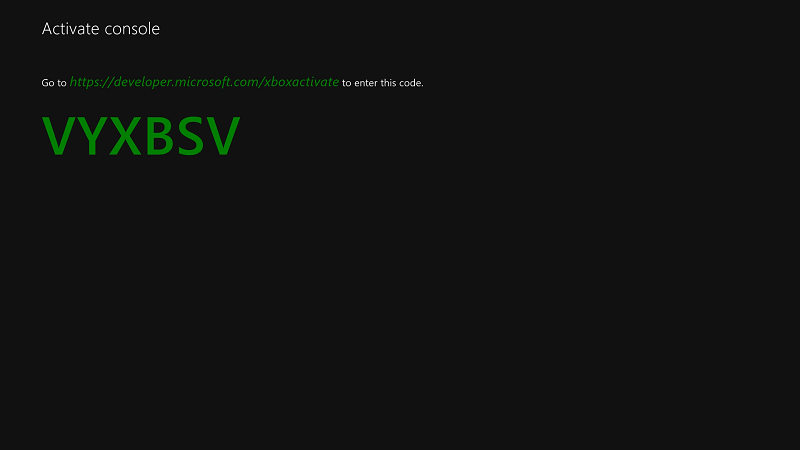
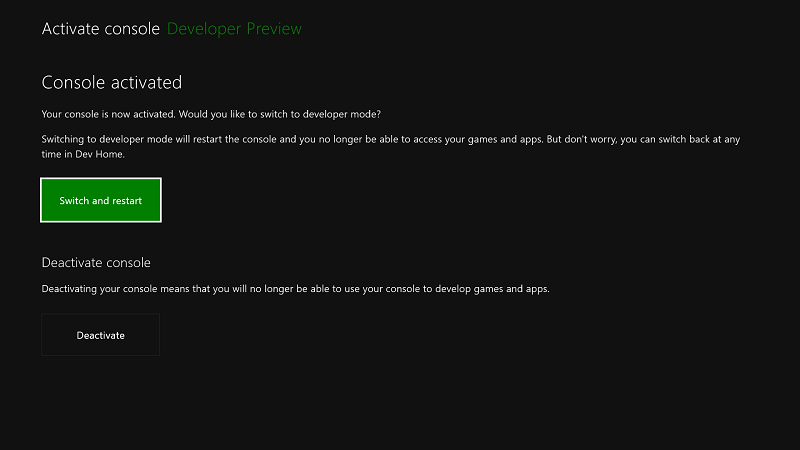

# Активация режима разработчика Xbox One

## Как работает режим разработчика
Xbox One поддерживает два режима: *коммерческий* режим (**1**) и режим *разработчика* (**2**). В коммерческом режиме, консоль находится в состоянии, подходящем для использования покупателем консоли Xbox One: можно играть в игры и запускать приложения в качестве пользователя. В режиме разработчика можно разрабатывать программное обеспечение для консоли, однако невозможно играть в коммерческие игры или запускать коммерческие приложения.

Режим разработчика можно включить на любой коммерческой консоли Xbox One. После включения режима разработчика можно переключаться между коммерческим режимом (**2a**) и режимом разработчика (**2b**).

## Активация режима разработчика на коммерческой консоли Xbox One

1.  Запустите консоль Xbox One.

2.  Выполните поиск и установите приложение **Dev Mode Activation** в магазине Xbox One.

    

3.  Запустите приложение на странице Store.

    

4.  Обратите внимание, что код отображается в приложении Dev Mode Activation.

      
    
5.  Перейдите к [partner.microsoft.com/xboxactivate](https://partner.microsoft.com/xboxactivate).

6.  Войдите в Центр разработки под своей учетной записью.

7.  Введите код активации, который отображается в приложении Dev Mode Activation. Количество активаций для вашей учетной записи ограничено. После активации режима разработчика Центр разработки укажет что вы использовали одну из активаций, связанных с вашей учетной записью.

        
    
8.  Щелкните **Принять и активировать**. Это приведет к перезагрузке страницы, после чего ваше устройство будет внесено в таблицу. Условия соглашения программы активации режима разработчика Xbox One можно найти в разделе [Программа активации режима разработчика Xbox One](http://go.microsoft.com/fwlink/p/?LinkId=760399).

9.  После ввода кода активации на консоли появится экран хода выполнения активации.  
    
10. После завершения активации откройте приложение Dev Mode Activation и щелкните **Переключиться и перезапустить**, чтобы перейти в режим разработчика. Обратите внимание, что это займет больше времени, чем обычно.

       

## Переключение между коммерческим режимом и режимом разработчика
После включения режима разработчика на консоли используйте **главную страницу разработки** для переключения между коммерческим режимом и режимом разработчика. Дополнительные сведения о запуске и использовании главной страницы разработки см. в разделе [Введение в средства Xbox One](introduction-to-xbox-tools.md).

* Чтобы переключиться в коммерческий режим, откройте **Dev Home**. В разделе **Быстрые действия**выберите **Выйти из режима разработчика **. Это приведет к перезапуску консоли в коммерческом режиме.    

    
  
* Чтобы переключиться в режим разработчика, используйте приложение Dev Mode Activation. Откройте приложение и выберите **Переключиться и перезапустить**. Это приведет к перезапуску консоли в режиме разработчика.  

    

## См. также следующие разделы.
- [Деактивация режима разработчика Xbox One](devkit-deactivation.md)
- [UWP на Xbox One](index.md)
