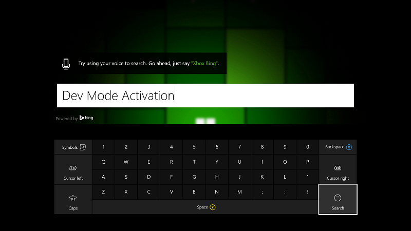
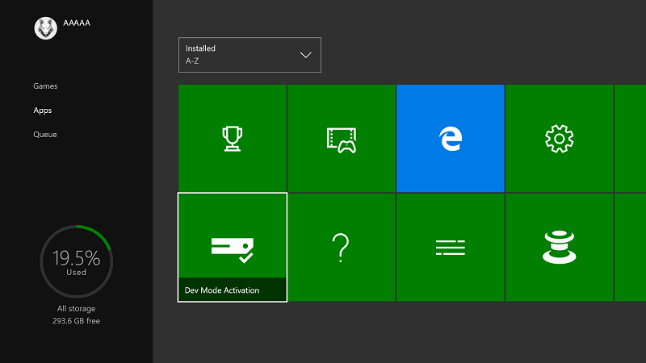

# Активация режима разработчика Xbox One

* [Как работает режим разработчика](#how-developer-mode-works)
* [Активация режима разработчика на коммерческой консоли Xbox One](#activate-developer-mode-on-your-retail-xbox-one-console)  
* [Переключение между коммерческим режимом и режимом разработчика](#switch-between-retail-and-developer-mode)

## Как работает режим разработчика
Xbox One поддерживает два режима: *коммерческий* режим (1) и режим *разработчика* (2). В коммерческом режиме, консоль находится в состоянии, подходящем для использования покупателем консоли Xbox One: можно играть в игры и запускать приложения в качестве пользователя. В режиме разработчика можно разрабатывать программное обеспечение для консоли, однако невозможно играть в коммерческие игры или запускать коммерческие приложения.
Режим разработчика можно включить на любой коммерческой консоли Xbox One. После включения режима разработчика можно переключаться между коммерческим режимом (2a) и режимом разработчика (2b).

> **Важно!**
            &nbsp;&nbsp;При активации режима разработчика на Xbox One вы подписываетесь на обновления системы Xbox для выпуска предварительной версии для разработчиков, которые включают экспериментальное программное обеспечение и ПО на ранних стадиях разработки. Это означает, что некоторые популярные игры и приложения будут работать неправильно, возможны периодические сбои и потери данных. Если вы выйдете из предварительной версии для разработчиков, консоль выполнит сброс и восстановление заводских настроек, и вам придется повторно устанавливать все игры, приложения и содержимое. 

> **Примечание.**
            &nbsp;&nbsp;Невозможно активировать режим разработчика на Xbox One, если вы уже являетесь участником программы предварительной версии, например бета-версии Xbox One. Выйти из действующей программы предварительной версии можно с помощью информационной панели предварительной версии Xbox. 

## Активация режима разработчика на коммерческой консоли Xbox One

1.  Запустите консоль Xbox One.

2.  Выполните поиск и установите приложение Dev Mode Activation в магазине Xbox One.  
    

3.  Перейдите в меню **Мои игры и приложения** > **Приложения**.

    
4. Откройте приложение Dev Mode Activation.    
    
    > **Примечание.**
            &nbsp;&nbsp;Внимательно прочитайте все пункты, связанные с ограничениями и отказом от ответственности. В рамках активации Xbox для разработки вы будете получать предварительные сборки. Чтобы играть и пользоваться приложениями, необходимо переключиться в коммерческий режим. Неопубликованные приложения будут работать только в режиме разработчика.

5.  Обратите внимание, что код отображается в приложении Dev Mode Activation.  

      
    
6.  Откройте страницу [developer.microsoft.com/xboxactivate](https://developer.microsoft.com/xboxactivate).
7.  Войдите в Центр разработки под своей учетной записью.  
8.  Введите код активации, который отображается в приложении Dev Mode Activation.   
   
     > **Примечание.**
            &nbsp;&nbsp;Количество активаций для вашей учетной записи ограничено. После активации режима разработчика Центр разработки укажет что вы использовали одну из активаций, связанных с вашей учетной записью. 
    
        
    
9.  Щелкните **Принять и активировать**. Это приведет к перезагрузке страницы, после чего ваше устройство будет внесено в таблицу.
    
    > **Примечание.**
            &nbsp;&nbsp;Условия соглашения о Программе активации режима разработчика Xbox One см. [здесь](http://go.microsoft.com/fwlink/?LinkId=760399).

10. После ввода кода активации на консоли появится экран хода выполнения активации.  
11. После завершения активации необходимо подождать обновления консоли до требуемой предварительной сборки. Это может занять несколько часов, поэтому запаситесь терпением.  

        
    
12. После завершения активации откройте приложение Dev Mode Activation и щелкните **Переключиться и перезапустить**, чтобы перейти в режим разработчика. Обратите внимание, что это займет больше времени, чем обычно.  

       
    

    
## Переключение между коммерческим режимом и режимом разработчика
После включения режима разработчика на консоли используйте **главную страницу разработки** для переключения между коммерческим режимом и режимом разработчика. Дополнительные сведения о запуске и использовании **главной страницы разработки** см. в разделе [Введение в средства Xbox One](introduction-to-xbox-tools.md).

* Чтобы перейти в коммерческий режим, используйте **главную страницу разработки** и щелкните **Закрыть режим разработчика**. Это приведет к перезапуску консоли в коммерческом режиме.    

    
  
* Чтобы переключиться в режим разработчика, используйте приложение Dev Mode Activation. Откройте приложение и щелкните **Переключиться и перезапустить**. Это приведет к перезапуску консоли в режиме разработчика.  

    

## См. также следующие разделы.
- [Деактивация режима разработчика Xbox One](devkit-deactivation.md)
- [UWP на Xbox One](index.md)

<!--HONumber=Jun16_HO4-->

