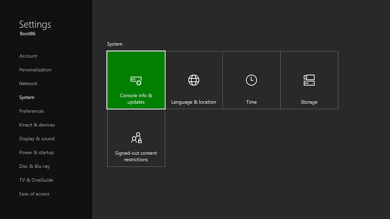
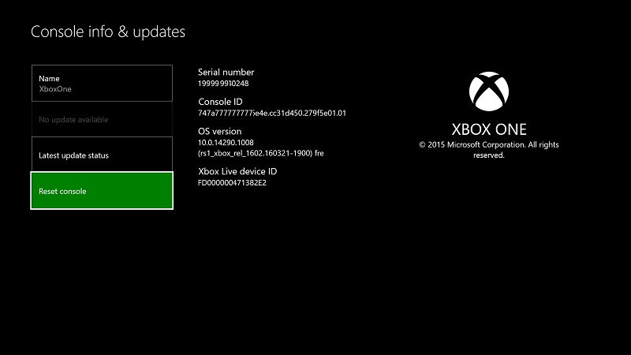

# Деактивация режима разработчика Xbox One

* [Переключение в коммерческий режим](#switch-to-retail-mode)
* [Деактивация консоли с помощью приложения Dev Mode Activation](#deactivate-your-console-using-the-dev-mode-activation-app)  
* [Сброс контроллера](#reset-your-console)
* [Деактивация консоли с помощью Центра разработки для Windows](#deactivate-your-console-using-windows-dev-center)

Если вы решили, что больше не будете использовать консоль для разработки, выполните следующие действия для деактивации режима разработчика.

## Переключение в коммерческий режим
Сначала верните консоль Xbox One в коммерческий режим.

1. Откройте **главную страницу разработчика**.
2. Щелкните **Выйти из режима разработчика**.  Консоль перезапустится в коммерческом режиме.  

   

Теперь деактивируйте консоль, используя один из следующих методов.

## Деактивация консоли с помощью приложения Dev Mode Activation

Предпочитаемый метод деактивации режима разработчика на консоли – это использование приложения Dev Mode Activation. 

1. Перейдите в меню **Мои игры и приложения** > **Приложения**.
  
       
   
2.  Откройте приложение Dev Mode Activation.    
3.  Щелкните **Деактивировать**.
  

## Сброс контроллера

Режим разработчика можно также деактивировать, сбросив настройки вашей консоли.  

> **Примечание.**
            &nbsp;&nbsp;При сбросе настроек консоли будут утрачены все локально сохраненные данные игр.

Чтобы сбросить настройки консоли, выполните следующие действия:

1.  Откройте **Мои игры и приложения**.  
2.  Выберите **Приложения**, затем выберите **Параметры**.  
3.  Откройте пункт **Система** на левой панели, затем выберите **Сведения о консоли и обновления** на правой панели.  
4.  Откройте **Сведения о консоли и обновления**.  
   
      
    
5.  Щелкните **Сбросить параметры консоли**.
    
    
    
6.  Затем щелкните **Сбросить и удалить все**. Этот параметр также сбрасывает консоль до ее исходного коммерческого состояния.  Все ваши приложения, игры и локально сохраненные данные будут удалены. Обратите внимание, что выбор другого параметра **Сбросить параметры и сохранить игры и приложения** не приведет к удалению консоли из программы разработчика.  
   
    

## Деактивация консоли с помощью Центра разработки для Windows

Если не удается получить доступ к консоли по какой-либо причине, вы также можете отключить режим разработчика с помощью Центра разработки для Windows.

1. Откройте [developer.microsoft.com/xboxdevices](https://developer.microsoft.com/xboxdevices).    
2. Войдите в Центр разработки под своей учетной записью.    
3. Найдите в списке консолей консоль, которую необходимо деактивировать, уточнив ее серийный номер, идентификатор консоли или идентификатор устройства.  
4. Щелкните **Деактивировать**.  
  

Если ранее вы не вернули консоль Xbox One в коммерческий режим, сделайте это прямо сейчас.

1. Откройте **главную страницу разработчика**.
2. Щелкните **Выйти из режима разработчика**.  Консоль перезапустится в коммерческом режиме.

## См. также следующие разделы.
- [Активация режима разработчика Xbox One](devkit-activation.md)
- [UWP на Xbox One](index.md)

<!--HONumber=Jun16_HO4-->

