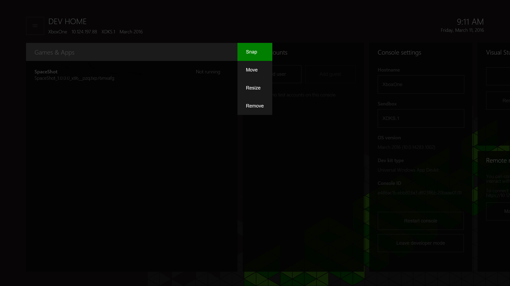
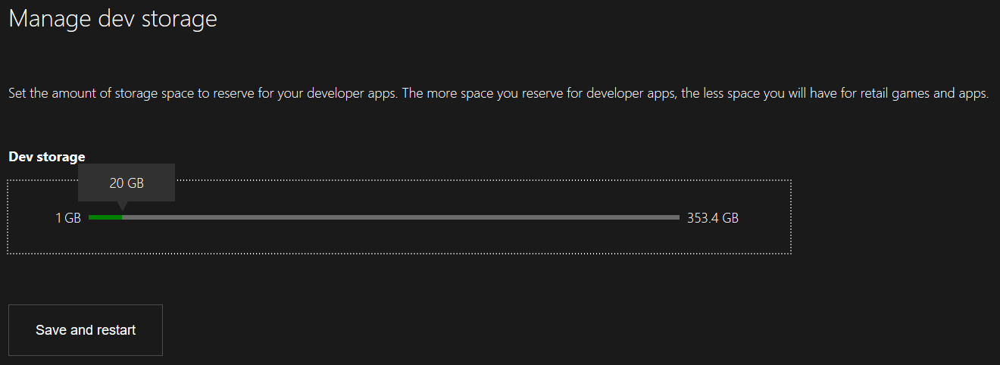
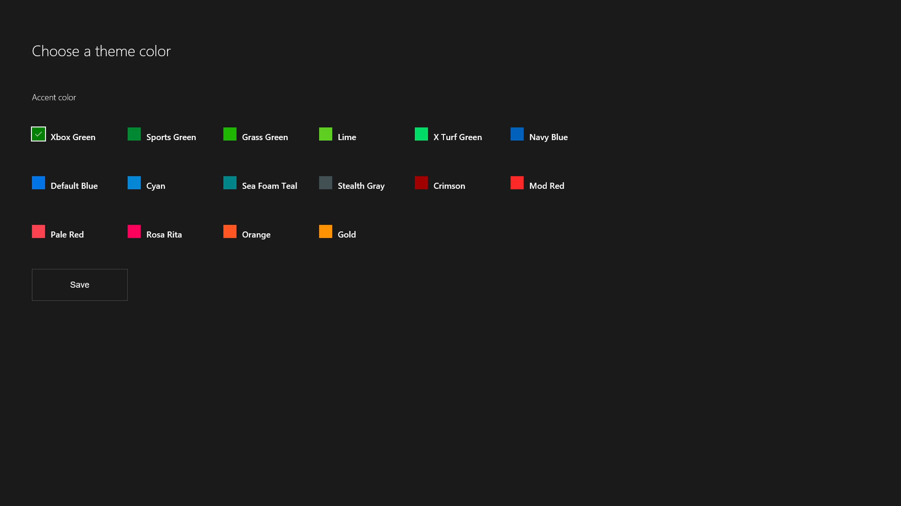

# Вводные сведения об инструментах Xbox One

В этом разделе рассматривается работа с инструментом _Dev Home_, созданным специально для Xbox One, с использованием портала Windows Device Portal.

## Dev Home

_Dev Home_ — это инструмент в составе комплекта средств разработки Xbox One Development Kit, предназначенный для того, чтобы повысить продуктивность разработчиков. Dev Home предоставляет функциональность для настройки комплекта средств разработки и управления им.

Чтобы открыть Dev Home, щелкните плитку **Dev Home** на начальном экране. Если плитка отсутствует, консоль не находится в режиме разработчика.

  

### Пользовательский интерфейс
Пользовательский интерфейс Dev Home разделен на разделы, которые описываются в следующих разделах. Обратите внимание, что здесь отображаются IP-адрес и понятное имя консоли.

  

#### Заголовок
Заголовок содержит важные обзорные сведения о комплекте средств разработки. Сюда относятся название консоли, ее IP-адрес, песочница Xbox Live, к которой она относится, и версия ОС, в которой она выполняется. Справа от заголовка для удобства отображаются текущие системные дата и время.

#### Окна инструментов
Под заголовком находится основная область приложения с набором настраиваемых окон инструментов. Они предназначены для настройки приложения разработчиками с тем, чтобы получить доступ к разным инструментам и наборам сведений. Более подробные сведения об этих инструментах см. в следующих описаниях отдельных инструментов. Сведения о настройке структуры и внешнего вида окон инструментов см. в разделе [Пользовательская настройка Dev Home](#customizing-dev-home) далее на этой странице.

##### Главное меню
Нажав кнопку **Меню** на контроллере или перейдя ко кнопке меню ("кнопке-гамбургеру") в верхней левой части экрана, можно открыть главное меню, которое позволяет настроить цвет темы и фоновое изображение для рабочего пространства приложения, а также предоставить обратную связь по приложению.

  

#### Режим прикрепления
Инструменты в Dev Home можно прикрепить сбоку во время работы с заголовком, чтобы получить удобный доступ к инструментам при тестировании.

Чтобы получить доступ к режиму **Прикрепление**, выберите название нужного инструмента, нажмите кнопку **Вид** на контроллере, а затем в контекстном меню выберите **Прикрепление**.

  

Dev Home прикрепится справа. Чтобы изменить контекст, достаточно дважды коснуться кнопки **Nexus**, как обычно.

  

##### Описания инструментов
| Инструмент  | Возможности |
|-------|--------------|
| Игры и приложения  | Перечисляет заголовки и приложения, установленные в комплект средств разработки, и указывает способ быстрого доступа к ним. Кроме того, в контекстном меню можно просмотреть и изменить состояние игр и приложений в рамках управления жизненным циклом процесса (PLM). |
| Пользователи | Перечисляет пользователей, зарегистрированных на консоли в данный момент. Позволяет одним щелчком входить в систему и выходить из нее, добавлять пользователей и гостей и просматривать сведения о пользователях и гостях. |
| [Параметры консоли](#console-settings) | Обзорное представление параметров консоли и сопутствующих сведений, а также функции для их редактирования. |
| Visual Studio | Позволяет связывать консоль с экземпляром Visual Studio в целях развертывания. При необходимости удалите любые существующие связанные экземпляры VS, чтобы не допустить развертывания приложения UWP в комплекте средств разработки. |
| [Портал Windows Device Portal](#windows-device-portal) | Включает WDP (инструмент управления устройствами в браузере) для комплекта. |
| Статус Xbox Live | Указывает на текущий статус службы Xbox Live. |

### Управление размером хранилища разработчика

Чтобы увеличить или уменьшить объем дискового пространства, используемый в качестве хранилища разработчика, выберите пункт **Управление хранилищем разработчика** в главном меню. Измените значение панели **Хранилище разработчика**, а затем выберите **Сохранить и перезапустить**, чтобы перезагрузить консоль.
  

### Пользовательская настройка Dev Home

Служба Dev Home предназначена для пользовательской настройки и персонализации. Можно выбрать фоновое изображение и цвет темы, тем самым создав вашу личную среду разработки Dev Home. Эти параметры находятся в главном меню.

#### Изменение размера и порядка инструментов
Чтобы изменить размер или положение инструмента, воспользуйтесь кнопкой в контекстном меню (кнопкой **Вид** на вашем контроллере), пока заголовок находится в фокусе. В контекстном меню выберите **Переместить** или **Изменить размер**.

  

#### Изменение цвета темы и фонового изображения
В главном меню можно выбрать **Изменить цвет темы**. Чтобы изменить цвет темы, используемый для выделения фокуса, выберите новый цвет и нажмите кнопку **Сохранить**.

  

### Отправка отзывов и предложений
Чтобы отправить отзывы и предложения по Dev Home или любым другим инструментам и процессам, выберите вариант **Предоставить отзыв** в главном меню.

  

## Параметры консоли
Инструмент "Параметры консоли" обеспечивает быстрый доступ к параметрам комплекта средств разработки.

### Настройка имени хоста для консоли
При взаимодействии с консолью с ПК разработки можно указать понятное имя (_имя хоста_) для комплекта средств разработки для Xbox One, чтобы использовать его в качестве альтернативы IP-адресу консоли. ПК разработки и комплект средств разработки должны находиться в одной подсети, чтобы соединение по имени хоста работало.  

Чтобы определить имя хоста для комплекта средств разработки, перейдите к инструменту "Параметры консоли" и введите имя хоста в поле __Имя хоста__.  

  > **Примечание**
            &nbsp;&nbsp;При создании имени хоста уникальность имени не задается принудительно. Старайтесь избегать дублирования имен. Один из способов решения этой задачи — создавать имя хоста на основе имени компьютера разработки, которое, как правило, является уникальным в организации.

## Портал Windows Device Portal
Портал Windows Device Portal (WDP) — это инструмент управления устройствами OneCore, позволяющий управлять устройствами в браузере.

Чтобы включить WDP на консоли Xbox One, выполните следующие действия.

1. Выберите плитку Dev Home на начальном экране.

  

2. В среде Dev Home перейдите к инструменту **Удаленное управление**.

  

3. Выберите __Управление порталом Windows Device Portal__ и нажмите кнопку __A__.
4. Установите флажок __Включить портал Windows Device Portal__.
5. Введите __Имя пользователя__ и __Пароль__ и сохраните их. Они используются для аутентификации при работе с комплектом средств разработки в браузере.
6. Закройте страницу __Параметры__ и запомните или запишите URL-адрес для подключения, указанный в инструменте _Удаленное управление_.
7. Введите URL-адрес в своем веб-браузере, а затем выполните вход с настроенными учетными данными.
8. Вы получите предупреждение о предоставленном сертификате (см. пример на следующем снимке), потому что сертификат безопасности подписан вашей консолью Xbox One, а она не считается известным и доверенным издателем. Щелкните **Перейти к этому веб-сайту**, чтобы перейти на портал Windows Device Portal.

  

## См. также
- [Технологии разработчика Microsoft: портал Windows Device Portal](https://msdn.microsoft.com/en-us/windows/uwp/debug-test-perf/device-portal-xbox)
- [Приложения UWP для Xbox One](index.md)

----

<!--HONumber=Jun16_HO4-->

