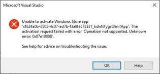

# Известные проблемы с предварительным выпуском для разработчиков UWP для Xbox

В этом разделе описаны известные проблемы с предварительным выпуском для разработчиков UWP для Xbox. Дополнительные сведения об этом предварительном выпуске для разработчиков см. в разделе [UWP для Xbox](index.md). 

\ [Если вы перешли сюда по ссылке в справочном разделе об API и ищете сведения об API для всех семейств устройств, см. раздел [Функции UWP, которые в настоящее время не поддерживаются в Xbox](http://go.microsoft.com/fwlink/?LinkID=760755).\]

Обновление системы Xbox Developer Preview включает экспериментальное ПО и ПО на ранних стадиях разработки перед выпуском. Это означает, что некоторые популярные игры и приложения будут работать неправильно, возможны периодические сбои и потери данных. Если вы выйдете из предварительной версии для разработчиков, консоль выполнит сброс и восстановление заводских настроек, и вам придется повторно устанавливать все игры, приложения и содержимое.

Для разработчиков это означает, что не все средства разработчика и API работают, как ожидается. Не все функции, предназначенные для окончательного выпуска, включены в предварительный выпуск или имеют качество готового к выпуску продукта. 
**В частности, производительность системы в этом выпуске не соответствует производительности окончательного выпуска.**

В следующем списке приведены некоторые известные проблемы, которые могут возникнуть при работе с этим выпуском (список не является исчерпывающим). 


              **Мы хотим услышать ваши отзывы**, поэтому сообщайте о любых возникающих проблемах на форуме [Разработка универсальных приложений для Windows](https://social.msdn.microsoft.com/Forums/windowsapps/en-US/home?forum=wpdevelop). 

Если ваша проблема не решена, прочитайте информацию в этом разделе и обратитесь к разделу [Часто задаваемые вопросы](frequently-asked-questions.md) и на форумы, чтобы получить помощь.


<!--## Developing games-->

## Поддержка режима мыши

Начиная с этой предварительной версии, _режим мыши_ включен по умолчанию как в приложениях XAML, так и в размещенных веб-приложениях. Все приложения, в которых этот режим не отключен, получат указатель мыши, аналогично тому, как это происходит в браузере Edge для Xbox.

**Настоятельно рекомендуем разработчикам отключать режим мыши и проводить оптимизацию для навигации с помощью контроллера (X-Y).**

Для отключения режима мыши в XAML изучите приведенный ниже пример.

```code
public App() {
    this.InitializeComponent();
    this.RequiresPointerMode = Windows.UI.Xaml.ApplicationRequiresPointerMode.WhenRequested;
    this.Suspending += OnSuspending;
}
```

Для отключения режима мыши в приложении на HTML и JavaScript изучите приведенный ниже пример.

```code
// Turn off mouse mode
navigator.gamepadInputEmulation = "keyboard";
```

Дополнительные сведения, включая способ включения направленной навигации в приложении на HTML и JavaScript, см. в разделе [Отключение режима мыши](how-to-disable-mouse-mode.md#html).

> 
              **Примечание.**&nbsp;&nbsp;В этой предварительной версии для разработчиков, если режим мыши включен, использование сдвига с помощью правого джойстика на контроллере может привести к зависанию консоли. Если вы столкнетесь с такой проблемой, потребуется перезагрузка консоли.

Сведения о поддержке режима мыши см. в разделе [Разработка для Xbox и ТВ](https://msdn.microsoft.com/windows/uwp/input-and-devices/designing-for-tv?f=255&MSPPError=-2147217396#mouse-mode). В этом разделе представлены сведения о том, как включать и отключать режим мыши, чтобы вы могли выбрать подходящее поведение для своего приложения.

## Для развертывания приложения необходимо, чтобы какой-либо пользователь выполнил вход (ошибка 0x87e10008)

Теперь приложения требуют от пользователя входа в систему для запуска (пользователь должен войти в систему, чтобы можно было начать отладку (F5) в VS 2015). Отображаемое сейчас сообщение об ошибке в Visual Studio не является интуитивно понятным.
 

 
Чтобы решить эту проблему, войдите в учетную запись пользователя из оболочки Xbox или DevHome перед развертыванием приложения.
 
## Ограничения памяти для фоновых приложений пока не вступили в силу
 
Ограничение в 128 МБ для приложений, работающих в фоновом режиме, не применяется в этой предварительной версии. Это означает, что если ваше приложение занимает более 128 МБ при работе в фоновом режиме, оно по-прежнему сможет дополнительно занимать память.
 
В настоящее время решения этой проблемы нет. Следует соответствующим образом наладить использование памяти приложением; в будущих предварительных версиях приложение будет получать отказы выделения памяти, если оно превысит лимит в размере 128 МБ.
 
## Развертывание из VS не выполняется при включенном родительском контроле

Запустить приложение из VS не удастся, если в параметрах консоли включена функция родительского контроля.

Чтобы решить эту проблему, временно отключите родительский контроль, либо выполните следующие действия.
1. Разверните приложение на консоли с выключенным родительским контролем
2. Включите родительский контроль
3. Запустите приложение с консоли
4. Введите ПИН-код или пароль, чтобы разрешить запуск приложения
5. Приложение запустится
6. Закройте приложение
7. Запустите из VS, нажав F5, и приложение запустится без каких-либо предварительных запросов

На этом этапе разрешение является _закрепленным_ до тех пор, пока не будет выполнен выход пользователя, даже если удалить и переустановить приложение.
 
Существует еще один тип исключения, доступный только для детских учетных записей. Учетная запись ребенка требует, чтобы родитель выполнил вход для выдачи разрешения, однако, когда это происходит родитель может выбрать параметр **Всегда**, чтобы разрешить ребенку запускать приложение. Это исключение хранится в облаке и останется в силе, даже если ребенок выйдет из приложения и снова войдет.   

<!--### x86 vs. x64

By the time we release later this year, we will have great support for both x86 and x64, and we do support x86 in this preview. 
However, x64 has had much more testing to date (the Xbox shell and all of the apps running on the console today are x64), and so we recommend using x64 for your projects. 
This is particularly true for games.

If you decide to use x86, please report any issues you see on the forum.

Also see [Switching build flavors can cause deployment failures](known-issues.md#switching-build-flavors-can-cause-deployment-failures) later on this page.-->

<!--### Game engines

We have tested some popular game engines, but not all of them, and our test coverage for this preview has not been comprehensive. 
Your mileage may vary. 

The following game engines have been confirmed to work:
* [Construct 2](https://www.scirra.com/)

There are likely others that are working too. We would love to get your feedback on what you find. 
Please use the forum to report any issues you see.-->

## Поддержка DirectX 12

UWP для Xbox One поддерживает DirectX 11 с уровнем компонентов 10. DirectX 12 в настоящее время не поддерживается. Xbox One, как и все традиционные игровые консоли,— это специализированный аппаратный компонент, для реализации полного потенциала которого требуется специальный комплект SDK. Если вы работаете с игрой, которая требует максимального использования возможностей оборудования Xbox One, можно зарегистрироваться в программе [ID@XBOX](http://www.xbox.com/Developers/id), чтобы получить доступ к этому комплекту SDK (в котором реализована поддержка DirectX 12).

<!-- ### Xbox One Developer Preview disables game streaming to Windows 10

Activating the Xbox One Developer Preview on your console will prevent you from streaming games from your Xbox One to the Xbox app on Windows 10, even if your console is set to retail mode. 
To restore the game streaming feature, you must leave the developer preview. -->

## Известная проблема с зоной безопасности на ТВ

По умолчанию область отображения в приложениях UWP на Xbox должна отображаться внутри зоны безопасности на ТВ. Однако предварительный выпуск для разработчиков Xbox One содержит известную ошибку, из-за которой зона безопасности на ТВ начинается в [0, 0], а не [_offset_, _offset_].

> 
              **Примечание.**&nbsp;&nbsp;Применяется только к приложениям UWP на JavaScript.

Самый простой способ обойти эту проблему— отключить зону безопасности на ТВ, как показано в следующем примере JavaScript.

    var applicationView = Windows.UI.ViewManagement.ApplicationView.getForCurrentView();

    applicationView.setDesiredBoundsMode(Windows.UI.ViewManagement.ApplicationViewBoundsMode.useCoreWindow);

Подробнее о зоне безопасности на ТВ см. в разделе [Разработка для Xbox и ТВ](https://msdn.microsoft.com/windows/uwp/input-and-devices/designing-for-tv).

<!--## System resources for UWP apps and games on Xbox One

UWP apps and games running on Xbox One share resources with the system and other apps, and so the system governs the resources that are available to any one game or app. 
If you are running into memory or performance issues, this may be why. 
For more details, see [System resources for UWP apps and games on Xbox One](system-resource-allocation.md).-->

<!--
## Networking using traditional sockets

In this developer preview, inbound and outbound network access from the console that uses traditional TCP/UDP sockets (WinSock, Windows.Networking.Sockets) is not available. 
Developers can still use HTTP and WebSockets.
--> 


## Охват API платформы UWP

Не все API UWP поддерживаются на Xbox. См. список API, которые, по имеющимся у нас сведениям, не работают, см. в разделе [Функции UWP, которые еще не поддерживаются в Xbox](http://go.microsoft.com/fwlink/p/?LinkId=760755). При обнаружении проблем с другими API следует сообщить о них на форумах. 

<!--## XAML controls do not look like or behave like the controls in the Xbox One shell

In this developer preview, the XAML controls are not in their final form. In particular:
* Gamepad X-Y navigation does not work reliably for all controls.
* Controls do not look like controls in the Xbox shell. This includes the control focus rectangle.
* Navigating between controls does not automatically make “navigation sounds.”

These issues will be addressed in a future developer preview.-->

<!--## Visual Studio and deployment issues

### Switching build flavors can cause deployment failures

Switching between Debug and Release builds, or between x86 and x64, or between Managed and .Net Native builds, can cause deployment failures. 

The simplest way to avoid these issues for this preview is to stick to Debug and one architecture. 

If you do hit this issue, uninstalling your app in the Collections app on your Xbox One will typically resolve it.

> ****&nbsp;&nbsp;Uninstalling your app from Windows Device Portal (WDP) will not resolve the issue.

If your issues persist, uninstall your app or game in the Collections app, leave Developer Mode, restart to Retail Mode and then switch back to Developer Mode.
You may also need to restart Visual Studio and clean your solution.

For more information, see the “Fixing deployment failures” section in [Frequently asked questions](frequently-asked-questions.md).

### Uninstalling an app while you are debugging it in Visual Studio will cause it to fail silently

Attempting to uninstall an app that is running under the debugger via the WDP “Installed Apps” tool will cause it to silently fail. 
The workaround is to stop debugging the app in Visual Studio before attempting to remove it via WDP.

### Visual Studio/Xbox PIN pairing failures

It is possible to get into a state where the PIN pairing between Visual Studio and your Xbox One gets out of sync. 
If PIN pairing fails, use the “Remove all pairings” button in Dev Home, restart Xbox One, restart your development PC, and then try again.--> 


## Предварительный выпуск портала Windows Device Portal (WDP)

<!--### Starting WDP from Dev Home crashes Dev Home

When you start WDP in Dev Home, it will cause Dev Home to crash after you have entered your user name and password and selected **Save**. 
The credentials are saved but WDP is not started. 
You can start WDP by restarting Xbox One.--> 

<!--### Disabling WDP in Dev Home does not work

If you disable WDP in Dev Home, it will be turned off. 
However, when you restart your Xbox One, WDP will be started again. 
You can work around this issue by using **Reset and keep my games & apps** to delete any stored state on your Xbox One. 
Go to Settings > System > Console info & updates > Reset console, and then select the **Reset and keep my games & apps** button.

> **Caution**&nbsp;&nbsp;Doing this will delete all saved settings on your Xbox One including wireless settings, user accounts and any game progress that has not been saved to cloud storage.

> **Caution**&nbsp;&nbsp;DO NOT select the **Reset and remove everything** button.
This will delete all of your games, apps, settings and content, deactivate Developer Mode, and remove you console from the Developer Preview group.

### The columns in the “Running Apps” table do not update predictably. 

Sometimes this is resolved by sorting a column on the table.-->

### Пользовательский интерфейс WDP неверно отображается в Internet Explorer 7 

По умолчанию пользовательский интерфейс WDP неверно отображается в браузере при использовании Internet Explorer 7. Для устранения этой проблемы отключите просмотр в режиме совместимости для WDP в Internet Explorer 7.

### Переход к WDP вызывает предупреждение о сертификате

Вы получите предупреждение о предоставленном сертификате (см. пример на следующем снимке), потому что сертификат безопасности подписан вашей консолью Xbox One, а она не считается известным и доверенным издателем. Щелкните "Перейти к этому веб-сайту", чтобы перейти на портал Windows Device Portal.


<!--## Dev Home

Occasionally, selecting the “Manage Windows Device Portal” option in Dev Home will cause Dev Home to silently exit to the Home screen. 
This is caused by a failure in the WDP infrastructure on the console and can be resolved by restarting the console.-->

## См. также
- [Вопросы и ответы](frequently-asked-questions.md)
- [Приложения UWP для Xbox One](index.md)


<!--HONumber=Jul16_HO2-->


